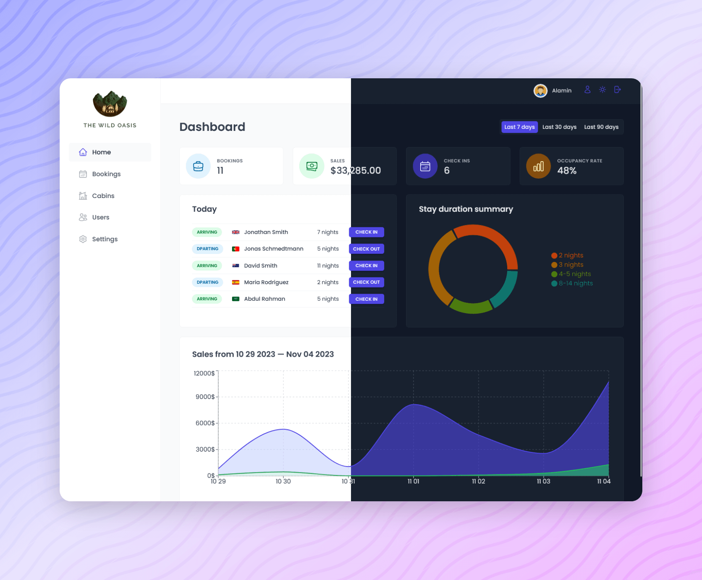

<div align="center">

  

  <h2>The Wild Oasis</h2>

  <h3>
    <a href="https://the-wild-oasis-alamin.vercel.app">
      <strong>Demo Website</strong>
    </a>
  </h3>

  <div align="center">
    <a href="https://the-wild-oasis-alamin.vercel.app">View Demo</a>
    •
    <a href="https://github.com/CodePapa360/The-Wild-Oasis/issues">Report Bug</a>
    •
    <a href="https://github.com/CodePapa360/The-Wild-Oasis/pulls">Request Feature</a>
  </div>

  <hr>

</div>

<!-- Badges -->
<div align="center">


<a href='https://www.twitter.com/CodePapa360' target="_blank"></a>
<a href='https://www.linkedin.com/in/codepapa360' target="_blank"></a>

</div>

<!-- Brief -->
<p align="center">
The Wild Oasis hotel management app is a full-featured React web application that allows hotel employees to manage cabins, bookings, and guests. The app uses Supabase for its backend and implements a variety of advanced React techniques, such as HOCs, the Compound Component Pattern, and React Query.
</p>

<!-- Screenshot -->
<a align="center" href="https://the-wild-oasis-alamin.vercel.app">



</a>

## Table of contents

- [Key Features](#key-features)
- [My process](#my-process)
  - [Built with](#built-with)
  - [What I learned](#what-i-learned)
- [Author](#author)
- [Acknowledgments](#acknowledgments)

## Key Features

- Users of the app are hotel employees. They need to be logged into the application to perform tasks

- New users can only be signed up inside the applications (to guarantee that only actual hotel employees can get accounts)

- Users should be able to upload an avatar, and change their name and password

- App needs a table view with all cabins, showing the cabin photo, name, capacity, price, and current discount

- Users should be able to update or delete a cabin, and to create new cabins (including uploading a photo)

- App needs a table view with all bookings, showing arrival and departure dates, status, and paid amount, as well as cabin and guest data

- The booking status can be "unconfirmed" (booked but not yet checked in), "checked in", or "checked out". The table should be filterable by this important status

- Other booking data includes: number of guests, number of nights, guest observations, whether they booked breakfast, breakfast price

- Users should be able to delete, check in, or check out a booking as the guest arrives

- Bookings may not have been paid yet on guest arrival. Therefore, on check in, users need to accept payment (outside the app), and then confirm that payment has been received (inside the app)

- On check in, the guest should have the ability to add breakfast for the entire stay, if they hadn't already

- Guest data should contain: full name, email, national ID, nationality, and a country flag for easy identification

- The initial app screen should be a dashboard, to display important information for the last 7, 30, or 90 days:

  - A list of guests checking in and out on the current day. Users should be able to perform these tasks from here

  - Statistics on recent bookings, sales, check ins, and occupancy rate

  - A chart showing all daily hotel sales, showing both "total" sales and "extras" sales (only breakfast at the moment)

  - A chart showing statistics on stay durations, as this is an important metric for the hotel

- Users should be able to define a few application-wide settings: breakfast price, min and max nights/booking, max guests/booking

- Dark mode

## Built with

- React
- Supabase
- React Query
- React Router
- React Hook Form
- React Hot Toast
- Recharts
- Styled Components
- Vite

## What I Learned

- **React Fundamentals:** I gained a solid understanding of React, including components, state management, and routing, allowing me to build dynamic user interfaces.

- **Authentication and User Management:** I implemented user authentication using Supabase, ensuring secure access for hotel employees and learned to manage user profiles effectively.

- **Form Handling:** I became proficient in managing forms with React Hook Form, simplifying form validation, submission, and data handling.

- **Data Fetching and Caching:** React Query was employed to fetch and cache data, enhancing the performance and responsiveness of the application.

- **Real-time Updates:** I integrated real-time data updates using Supabase, enabling instant changes to cabin and booking data.

- **Responsive UI Design:** Styled Components were used to create responsive and visually appealing user interfaces that adapt to various screen sizes.

- **Toast Notifications:** React Hot Toast added user-friendly notifications for various actions within the app, improving the overall user experience.

- **Data Visualization:** Recharts was employed for creating charts and visual representations of vital statistics, aiding in data analysis and decision-making.

- **Routing and Navigation:** React Router facilitated smooth navigation and seamless transitions between different views and pages within the application.

- **Settings Management:** I learned to allow users to configure application-wide settings, such as breakfast pricing and booking constraints.

- **Higher-Order Components (HOC):** I utilized Higher-Order Components to enhance code reusability and share common functionalities among multiple components.

- **Compound Component Pattern:** I implemented the Compound Component Pattern to create cohesive and reusable component groups, improving the organization and maintainability of the code.

- **Dark Mode Implementation:** Dark mode was implemented to offer users a personalized visual experience and accommodate different preferences.

- **Git Version Control:** I practiced effective version control using Git, allowing for code management, and tracking project changes.

- **Project Planning and Management:** I gained experience in planning and managing a large-scale project, including feature development, bug fixing, and testing.

By building "The Wild Oasis" project with these technologies and concepts, I've developed a comprehensive set of skills and knowledge that can be applied to future projects and real-world scenarios. This experience has not only expanded my technical expertise but also improved my problem-solving capabilities.

## Installation

- Clone this repo:

```sh
git clone https://github.com/CodePapa360/The-Wild-Oasis.git
```

- Install dependencies:

```sh
npm install
```

- Build command:

```sh
npm run build
```

- Live server:

```sh
npm run dev
```

## Author

<b>👤 Alamin</b>

- Twitter - [@CodePapa360](https://www.twitter.com/CodePapa360)
- LinkedIn - [@CodePapa360](https://www.linkedin.com/in/codepapa360)
- Frontend Mentor - [@CodePapa360](https://www.frontendmentor.io/profile/CodePapa360)
- Github: [@CodePapa360](https://github.com/codepapa360)

Feel free to contact me with any questions or feedback!

## Acknowledgments

This app was developed as part of the [Udemy course](https://www.udemy.com/course/the-ultimate-react-course) "The Ultimate React Course 2023: React, Redux & More" by [Jonas Smechmann](https://twitter.com/jonasschmedtman). Special thanks to Jonas for his exceptional teaching and guidance during the course.
