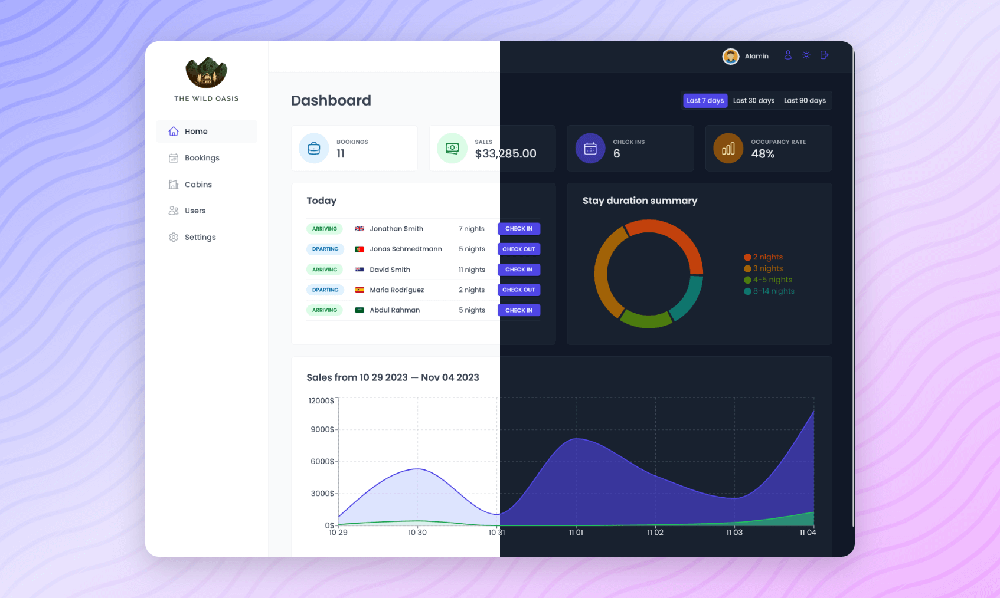

<div align="center">

  

  <h2>The Wild Oasis</h2>

  <h3>
    <a href="https://the-wild-oasis-alamin.vercel.app">
      <strong>Demo Website</strong>
    </a>
  </h3>

  <div align="center">
    <a href="https://the-wild-oasis-alamin.vercel.app">View Demo</a>
    -
    <a href="/issues">Report Bug</a>
    -
    <a href="/pulls">Request Feature</a>
  </div>

  <hr>

</div>

<!-- Badges -->
<div align="center">


<a href='https://www.twitter.com/CodePapa360' target="_blank"></a>
<a href='https://www.linkedin.com/in/codepapa360' target="_blank"></a>

</div>

<!-- Brief -->
<p align="center">
This is a demo briefing 
</p>

<!-- Screenshot -->
<a align="center" href="https://the-wild-oasis-codepapa.vercel.app">



</a>

## Key Features

## Built with

- [React](https://reactjs.org) - A JavaScript library for building user interfaces
- [Redux Toolkit](https://redux-toolkit.js.org) - A simplified, efficient, and powerful Redux library for building state management systems
- [Styled Components](https://styled-components.com) - A library that allows you to write CSS in JS/Reactjs
- [Vite](https://vitejs.dev/) - A JavaScript module bundler and development server.

## What I Learned

## Installation

- Clone this repo:

```sh
git clone https://github.com/CodePapa360/The-Wild-Oasis.git
```

- Install dependencies:

```sh
npm install
```

- Build command:

```sh
npm run build
```

- Live server:

```sh
npm run dev
```

## Author

<b>👤 Alamin</b>

- Twitter - [@CodePapa360](https://www.twitter.com/CodePapa360)
- LinkedIn - [@CodePapa360](https://www.linkedin.com/in/codepapa360)
- Frontend Mentor - [@CodePapa360](https://www.frontendmentor.io/profile/CodePapa360)
- Github: [@CodePapa360](https://github.com/codepapa360)

Feel free to contact me with any questions or feedback!

## Credits

This app was created as part of [Jonas Smechmann's](https://twitter.com/jonasschmedtman) Udemy course named [The Ultimate React Course 2023: React, Redux & More](https://www.udemy.com/course/the-ultimate-react-course)

Special thanks to Jonas for his excellent teaching and guidance throughout the course.
